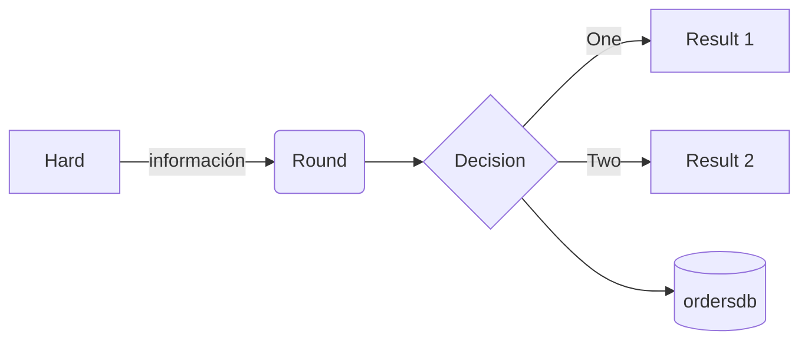

# ejemploGithub

## Diagramas

```mermaid
graph LR;
  ordersDB[(ordersdb)]
  A[Hard] -->|información| B(Round)
  B --> C{Decision}
  C -->|One| D[Result 1]
  C -->|Two| E[Result 2]
  C --> ordersDB

```
